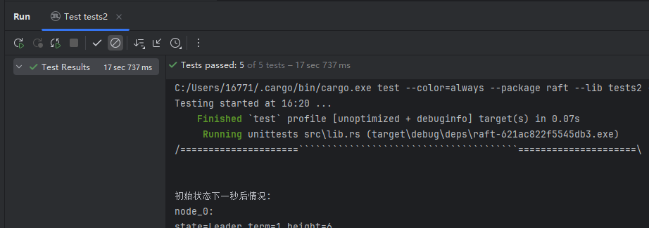

# 利用 Rust 实现一个 Raft 共识协议

## 1. 项目目的

使用Rust语言实现一个简单的Raft共识协议。目标是使得一个集群的服务器组成复制状态机从而实现一致性。

## 2. 使用语言

Rust 100%


## 3.Raft简介

Raft能为在计算机集群之间部署有限状态机提供一种通用方法，并确保集群内的任意节点在某种状态转换上保持一致。

Raft通过将共识问题分解成几个相对独立的子问题来简化理解：领导人选举、日志复制和安全性。

### 3.1领导人选举

在Raft中，服务器可以处于三种状态之一：领导人（Leader）、追随者（Follower）或候选人（Candidate）。系统正常运行时通常只有一个领导人，其余节点都是追随者。领导人负责处理所有客户端请求（写操作），并将新的条目添加到自己的日志中，然后复制给其他服务器。如果一个追随者在一段时间内没有收到领导人的消息（心跳），它会认为系统中没有领导人，并发起选举尝试成为领导人。

### 3.2日志复制

领导人一旦选出，就开始接收客户端请求并向其日志中添加新条目。领导人随后将这些条目复制到其他服务器的日志中。当大多数服务器都成功地将条目复制到它们的日志中后，领导人会应用这些条目到它的状态机，并向客户端响应。其他服务器也会在稍后应用这些条目。

### 3.3安全性

Raft算法包含了一些关键的安全性特性以确保一致性。

除了上述核心机制外，Raft还解决了分布式系统中的一些常见挑战，如网络分区、服务器崩溃和恢复等。它通过超时机制和随机选举超时来减少分裂投票的可能性，从而提高了达成共识的概率。

## 4.数据结构设计

### 4.1 日志

```rust
pub struct LogEntry {
   pub term: i32,			// 任期
   pub height: i32,		// 区块高度
   pub leader_id: i32,		// 领导者id
   pub is_apply: bool,		// 用于区分是进行区块验证还是进行日志添加
   pub info: String,		// 区块信息(交易打包结果等)
}
```

日志结构体，用于传输日志信息。如果需要网络传输，需要编码为字符串后加密（TLS加密等属于共识模块直接调用的网络层部分，不做具体实现）。

### 4.2 WAL

```rust
pub struct WAL {
   pub id: i32,				// 当前节点id
   pub logs: Vec<LogEntry>,	// 存储日志
   pub local_path: String,		// 本地文件存储地址
}
```

WAL 是一种日志记录机制，广泛应用于数据库和分布式系统中，用于在数据修改之前先记录操作日志，以便在系统崩溃或重启后能够恢复数据。共识过程中，WAL 主要用于记录和持久化共识状态、操作等信息，确保数据的一致性和可靠性。

### 4.3 CMState

```rust
pub enum CMState {
   Follower,   // 跟随者状态
   Candidate,  // 候选人状态
   Leader,     // 领导者状态
   Dead,       // 已停止状态
}
```

节点状态

### 4.4 投票信息相关数据

```rust
/// 请求投票RPC的参数
pub struct RequestVoteArgs {
   pub term: i32,				// 任期
   pub candidate_id: i32,		// 候选人id
   pub last_apply: i32,		// 上一区块高度
}

/// 请求投票RPC的响应
pub struct RequestVoteReply {
   pub term: i32,				// 任期
   pub vote_granted: bool,		// 通过投票
   pub leader_id: i32,			// 领导者id
   pub last_apply: i32,		// 上一区块高度
}
```

### 4.5 心跳信息相关数据

```rust
/// 心跳RPC的参数
pub struct AppendEntriesArgs {
   pub term: i32,				// 任期
   pub leader_id: i32,			// 领导者id
   pub prev_log_index: i32,	// 上一log序号
   pub prev_log_term: i32,		// 上一log任期
   pub entries: Vec<LogEntry>,	// 日志实体
   pub leader_commit: i32,		// 领导者
   pub self_node_id: i32,		// id
   pub last_apply: i32,		// 上一区块高度
}

/// 心跳RPC的响应
pub struct AppendEntriesReply {
   pub term: i32,				// 任期
   pub success: bool,			// 通过
   pub leader_id: i32,			// 领导者id
   pub last_apply: i32,		// 上一区块高度
   pub peer_ids: Vec<i32>,		// 其余节点id
}
```

### 4.6 Server

```rust
/// Server包装了ConsensusModule并管理RPC通信
pub struct Server {
   server_id: i32,
   peer_ids: Vec<i32>,
   cm: Arc<Mutex<ConsensusModule>>,
   rpc_proxy: Option<Arc<RPCProxy>>,
   // ready: mpsc::Receiver<()>,
   shutdown: bool,
   want_be_leader: bool, // 设置了一个是否想变为leader的选项, 用于控制领导者选举, 不至于全是领导者导致超时
}
```

### 4.7 ConsensusModule

```rust
/// ConsensusModule实现了Raft共识的单个节点
pub struct ConsensusModule {
    id: i32,                                 // 节点ID
    peer_ids: Vec<i32>,                      // 其他节点的ID列表
    peer_ids_set: HashSet<i32>,              // 其他节点的ID列表
    leader_id: i32,                          // leader id
    current_term: i32,                       // 当前任期
    voted_for: Option<i32>,                  // 在当前任期投票给谁
    log: WAL,                                // 日志
    apply_log_vote_received:i32,             // 当前发送的日志接受票数
    is_spv: bool,                            // 是否SPV节点
    state: CMState,                          // 当前状态
    election_reset_event: Instant,           // 上次重置选举计时器的时间
    election_timeout_min: Duration,          // 最小选举超时时间
    election_timeout_max: Duration,          // 最大选举超时时间
    self_last_heart_beat: Instant,           // 自己上次心跳时间
    heart_beat_events: Vec<Instant>,         // 上次收到其他节点的心跳时间
    heart_beat_timeout_min: Duration,        // 最小心跳超时时间
    heart_beat_timeout_max: Duration,        // 最大心跳超时时间
    votes_received: i32,                     // 收到的投票数
    commit_index: i32,                       // 已提交的最高日志索引
    last_applied: i32,                       // 已应用到状态机的最高日志索引
    end_thread: bool,                        // 结束tag
    want_be_leader: bool,                    // 想要变成leader
}
```

## 5. Raft实现

### 5.1 LogEntry

日志相关功能

```rust
pub fn new(term: i32, height:i32, leader_id: i32, info: String) -> LogEntry // 构造一个新的 LogEntry 实例
pub fn encode(&self) -> String // 将 LogEntry 实例编码为字符串，并加密
pub fn decode(string: String) -> Result<LogEntry> // 从字符串解码并返回一个新的 LogEntry 实例，解密并解析字符串
pub fn encrypt(string: String) -> String // 模拟对给定字符串进行加密（此处未实现具体加密逻辑）
pub fn decrypt(string: String) -> String // 模拟对给定字符串进行解密（此处未实现具体解密逻辑）
```

### 5.2 Server

```rust
pub fn new(id: i32, peer_ids: Vec<i32>) -> Self // 创建一个新的服务器实例，初始化共识模块并设置服务器ID和对等节点ID列表
pub async fn serve(&mut self) -> Result<()> // 启动服务器，处理其主要逻辑
pub async fn shutdown(&mut self) // 异步地关闭服务器，设置shutdown标志为true，并通知共识模块结束线程
pub fn set_rpc_proxy(&mut self, rpc_proxy: Arc<RPCProxy>) // 设置服务器使用的RPC代理，用于与其它服务器通信
```

### 5.3 ConsensusModule

```rust
pub fn new(id: i32, peer_ids: Vec<i32>) -> Self // 创建一个新的共识模块实例，并初始化相关参数和状态
fn clear_peer_ids_set(&mut self) // 清除对等节点ID集合
fn election_timeout(&self) -> Duration // 计算选举超时时间，使用随机化机制以减少同时选举的可能性
fn init_peer_ids_heart(&mut self) // 初始化心跳信息，为每个对等节点设置心跳事件
fn reset_election_timer(&mut self) // 重置选举超时计时器
fn become_follower(&mut self, term: i32, leader_id: i32) // 将当前状态转变为跟随者，并更新相关参数
fn become_leader(&mut self) // 将当前状态转变为领导者，并更新相关参数
pub fn request_vote(&mut self, args: RequestVoteArgs) -> RequestVoteReply // 处理请求投票RPC，根据条件决定是否投票给候选者
pub fn append_entries(&mut self, args: AppendEntriesArgs) -> AppendEntriesReply // 处理心跳信息（日志条目追加）RPC，更新心跳时间并处理日志同步
pub fn send_msg(&mut self, msg_string: String) -> SendMsgReply // 处理区块消息RPC，解析消息内容并根据类型应用或投票
fn start_election(&mut self) // 转变为候选人状态并开始选举过程，增加当前任期并给自己投票
```


## 6.测试

由于引入了随机功能（比如随机延迟模拟网络延迟、节点宕机等），所以不是每次测试都是理想结果（但是是近似理想结果），多次测试能得到理想结果。

### 6.1 测试类

#### 6.1.1 模拟使用结构体

模拟共识算法中的网络连接

```rust
/// 模拟共识算法中的网络连接
/// 1. 模拟RPC传输中的延迟
/// 2. 模拟不可靠的网络连接
pub struct RPCProxy {
    cm_list: Vec<Arc<Mutex<ConsensusModule>>>,
    rng: Arc<Mutex<OsRng>>,
}
```

```rust
pub fn new(cm_list: Vec<Arc<Mutex<ConsensusModule>>>) -> Self // 构造一个新的 RPCProxy 实例，并初始化随机数生成器用于模拟网络延迟
pub async fn request_vote(&self, server_id: i32, args: RequestVoteArgs) -> Result<RequestVoteReply> // 处理投票请求的RPC调用，模拟网络延迟并转发请求到指定服务器的共识模块
pub async fn append_entries(&self, server_id: i32, args: AppendEntriesArgs) -> Result<AppendEntriesReply> // 处理心跳信息或日志条目追加的RPC调用，模拟网络延迟并转发请求到指定服务器的共识模块
pub async fn send_msg(&self, server_id: i32, send_msg_args: SendMsgArgs) -> Result<SendMsgReply> // 处理区块消息的RPC调用，模拟网络延迟并转发请求到指定服务器的共识模块
pub fn get_cm(&self, server_id: i32) -> Result<Arc<Mutex<ConsensusModule>>> // 获取指定服务器ID对应的共识模块实例
```

#### 6.1.2 调用共识模块使用结构体

```rust
/// RaftCluster 管理一组 Raft 节点
pub struct RaftCluster {
    servers: Vec<Server>,
    ready_txs: Vec<mpsc::Sender<()>>,
    cm_list: Vec<Arc<Mutex<ConsensusModule>>>,
}
```

```rust
pub async fn new_with_leader(leader_id: i32, leaders: Vec<i32>) -> Result<Self> // 创建一个新的 Raft 集群并指定初始领导者，同时设置有成为领导者资质的节点
pub async fn new() -> Result<Self> // 创建一个新的 Raft 集群，初始化五个节点，并为每个节点配置RPC代理
pub fn set_want_be_leader(&mut self, index: i32) -> Result<()> // 设置指定索引的服务器想要成为领导者，并更新其共识模块的相关状态
pub fn get_leader(&self) -> Option<(i32, i32)> // 获取当前集群中的领导者信息（ID和任期）
pub fn get_cm_info_by_id(&self, id: i32) -> Option<(i32, i32, i32, CMState, Vec<i32>, i32, Vec<LogEntry>)> // 通过ID查询对应共识协议的信息，包括ID、领导者ID、当前任期、状态、对等节点ID列表、最后应用的日志高度和日志条目
pub async fn wait_for_new_leader(&self, old_leader: i32, timeout_ms: u64) -> Option<(i32, i32)> // 等待新的领导者被选出，在指定超时时间内返回新领导者的ID和任期
pub fn stop_heartbeat(&self, node_id: i32) -> Result<()> // 停止指定节点的心跳发送，将节点状态设置为Dead，并清除投票记录
fn get_cm(&self, server_id: i32) -> Result<Arc<Mutex<ConsensusModule>>> // 获取指定服务器的共识模块实例
```

### 6.2 测试点及测试结果

#### 6.2.1 测试领导者宕机1

```rust
/// 测试节点0停止后的领导者选举, 单节点可能变为leader
#[tokio::test]
async fn test_leader_stop_election() -> Result<()>
```

1. **创建并初始化集群**:
   - 创建一个新的 Raft 集群，并指定节点0为初始领导者。
   - 等待片刻以确保集群稳定。
2. **验证初始领导者**:
   - 检查当前领导者是否为节点0。
   - 打印确认信息。
3. **模拟节点0故障**:
   - 将节点0的状态设置为死亡（Dead）。
4. **等待新领导者选举**:
   - 等待一段时间，以便其他节点可以检测到节点0的故障并进行新的领导者选举。
5. **验证新领导者**:
   - 检查是否有新的领导者被选出。
   - 确认新领导者不是节点0，并且是剩余节点（1-4）中的一个。
   - 打印新领导者的ID和任期。

```rust
/=====================```````````````````````````````````````=====================\


初始领导者为0
任期为1 


\=====================.......................................=====================/

/=====================```````````````````````````````````````=====================\


节点2尝试成为新leader 


\=====================.......................................=====================/

/=====================```````````````````````````````````````=====================\


选出新的领导者: id=2
任期为2 


\=====================.......................................=====================/
```

领导者死亡后，有成为领导者能力的结点通过选举成为leader，并且任期提高。

#### 6.2.2 测试领导者宕机2

```rust
/// 测试节点0停止后的领导者选举, 多节点可能变为leader
#[tokio::test]
async fn test_leader_stop_election_2() -> Result<()>
```

1. **创建并初始化集群**:
   - 创建一个新的 Raft 集群，并指定节点0为初始领导者。
   - 等待片刻以确保集群稳定。
2. **验证初始领导者**:
   - 检查当前领导者是否为节点0。
   - 打印确认信息。
3. **模拟节点0故障**:
   - 将节点0的状态设置为死亡（Dead）。
   - 打印确认信息。
4. **等待新领导者选举**:
   - 等待一段时间，以便其他节点可以检测到节点0的故障并进行新的领导者选举。
5. **验证新领导者**:
   - 检查是否有新的领导者被选出。
   - 确认新领导者不是节点0，并且是剩余节点（1-4）中的一个。
   - 打印新领导者的ID和任期。
   - 如果成功选出新领导者，测试通过；否则，测试失败。
6. **模拟第一个新领导者故障**:
   - 将第一个新领导者的状态设置为死亡（Dead）。
7. **等待第二次新领导者选举**:
   - 再次等待1秒钟，以便其他节点可以检测到第一个新领导者的故障并进行新一轮的领导者选举。
8. **验证第二个新领导者**:
   - 检查是否有新的领导者被选出。
   - 确认新领导者不是之前任何一个已停止的节点，并且是剩余节点（1-4）中的一个。
   - 打印新领导者的ID和任期。

```
/=====================```````````````````````````````````````=====================\


节点2尝试成为新leader 


\=====================.......................................=====================/

/=====================```````````````````````````````````````=====================\


选出新的领导者: id=2
任期为2 


\=====================.......................................=====================/

/=====================```````````````````````````````````````=====================\


节点4尝试成为新leader 


\=====================.......................................=====================/

/=====================```````````````````````````````````````=====================\


选出新的领导者: id=4
任期为3 


\=====================.......................................=====================/
```

领导者节点连续死亡，其余领导者连续选举成功。

#### 6.2.3 测试死去的结点复活后的状态

```rust
/// 测试死去的结点0复活后的状态
#[tokio::test]
async fn test_node0_revive() -> Result<()>
```

1. **创建并初始化集群**:
   - 创建一个新的 Raft 集群，并指定节点0为初始领导者。
   - 等待100毫秒以确保集群稳定。
2. **验证初始领导者**:
   - 检查当前领导者是否为节点0。
   - 打印确认信息。
3. **模拟节点0故障**:
   - 将节点0的状态设置为死亡（Dead）。
   - 打印确认信息。
4. **等待新领导者选举**:
   - 等待1秒钟，以便其他节点可以检测到节点0的故障并进行新的领导者选举。
5. **验证新领导者**:
   - 检查是否有新的领导者被选出。
   - 确认新领导者不是节点0，并且是剩余节点（1-4）中的一个。
   - 打印新领导者的ID和任期。
   - 如果成功选出新领导者，继续下一步；否则，测试失败。
6. **模拟节点0复活**:
   - 将节点0的状态从死亡（Dead）恢复为跟随者（Follower）。
7. **等待集群稳定**:
   - 再次等待1秒钟，给予集群时间适应节点0的复活。
8. **检查节点0的状态**:
   - 读取节点0的共识模块信息，包括领导者ID、当前任期和状态。
   - 打印节点0的当前状态信息。

```
/=====================```````````````````````````````````````=====================\


初始领导者为0
任期为1 


\=====================.......................................=====================/

/=====================```````````````````````````````````````=====================\


节点2尝试成为新leader 


\=====================.......................................=====================/

/=====================```````````````````````````````````````=====================\


选出新的领导者: id=2
任期为2 


\=====================.......................................=====================/

/=====================```````````````````````````````````````=====================\


节点0复活 


\=====================.......................................=====================/

/=====================```````````````````````````````````````=====================\


节点0当前状态为
leader_id=2
tmp_current_term=2
state=Follower 


\=====================.......................................=====================/
```

节点0死亡前为leader，复活后能正确找到领导者，并更新任期信息。

#### 6.2.4 测试死亡多个节点并复活后节点状态

```rust
/// 测试死亡两个节点0 1前后以及复活0后, 其他节点同辈节点数量
#[tokio::test]
async fn test_node1_revive() -> Result<()>
```

1. **创建并初始化集群**:
   - 创建一个新的 Raft 集群，并指定节点0为初始领导者。
   - 等待100毫秒以确保集群稳定。
2. **验证初始领导者**:
   - 检查当前领导者是否为节点0，并打印确认信息。
3. **模拟节点0和节点1故障**:
   - 将节点0和节点1的状态设置为死亡（Dead）。
   - 打印确认信息，表示节点0和节点1已设置为死亡状态。
4. **等待新领导者选举和信息同步**:
   - 等待1秒钟，以便其他节点可以检测到节点0和节点1的故障，并进行新的领导者选举以及信息同步。
5. **记录节点0和节点1死亡状态下的集群情况**:
   - 打印每个节点的信息（ID、领导者ID、任期、状态和对等节点列表），以记录在节点0和节点1死亡状态下其他节点的情况。
6. **模拟节点0和节点1复活**:
   - 将节点0和节点1的状态从死亡（Dead）恢复为跟随者（Follower）。
7. **等待信息同步完成**:
   - 等待3秒钟，给予集群时间适应节点0和节点1的复活，并完成信息同步。
8. **记录节点0和节点1复活后的集群情况**:
   - 再次打印每个节点的信息（ID、领导者ID、任期、高度、状态和对等节点列表），以记录在节点0和节点1复活后其他节点的情况。

```
/=====================```````````````````````````````````````=====================\


初始领导者为0
任期为1 


\=====================.......................................=====================/

/=====================```````````````````````````````````````=====================\


节点2尝试成为新leader 


\=====================.......................................=====================/

/=====================```````````````````````````````````````=====================\


节点0 1死亡状态下其他节点稳定后情况:
node_0
leader_id=0
term=1
state=Dead
peers=[1, 2, 3, 4]

node_1
leader_id=0
term=1
state=Dead
peers=[0, 2, 3, 4]

node_2
leader_id=2
term=2
state=Leader
peers=[3, 4]

node_3
leader_id=2
term=2
state=Follower
peers=[4, 2]

node_4
leader_id=2
term=2
state=Follower
peers=[3, 2]

 


\=====================.......................................=====================/

/=====================```````````````````````````````````````=====================\


节点1尝试成为新leader 


\=====================.......................................=====================/

/=====================```````````````````````````````````````=====================\


节点0 1复活后其他节点稳定后情况:
node_0
leader_id=2
term=2 height=41
state=Follower
peers=[1, 3, 2, 4]

node_1
leader_id=2
term=2 height=41
state=Follower
peers=[3, 2, 0, 4]

node_2
leader_id=2
term=2 height=41
state=Leader
peers=[0, 3, 4, 1]

node_3
leader_id=2
term=2 height=41
state=Follower
peers=[0, 1, 2, 4]

node_4
leader_id=2
term=2 height=41
state=Follower
peers=[1, 2, 0, 3]

 


\=====================.......................................=====================/
```

节点0,1死亡后，其他几个节点能够检测到节点0,1的死亡，并且更新自己的peers信息。节点0,1复活后，其余几个节点能够检测到信息，并且更新添加自己的peers信息。并且节点0,1能够更新自己的term、height、leader_id等信息。

#### 6.2.5 测试不同情况下block_height

```rust
/// 测试block_height
#[tokio::test]
async fn test_block_height() -> Result<()>
```

1. **创建并初始化集群**:
   - 创建一个新的 Raft 集群，并指定节点0为初始领导者。
   - 等待1秒钟以确保集群稳定。
2. **记录初始状态下集群情况**:
   - 打印每个节点的状态（ID、状态、任期和日志高度），记录集群在一秒钟后的初始情况。
3. **再次等待并记录集群情况**:
   - 再次等待1秒钟。
   - 打印每个节点的状态（ID、状态、任期和日志高度），记录集群在两秒钟后的初始情况。
4. **模拟节点0和节点1故障**:
   - 将节点0和节点1的状态设置为死亡（Dead）。
   - 打印确认信息，表示节点0和节点1已设置为死亡状态。
5. **等待新领导者选举和信息同步**:
   - 等待1秒钟，以便其他节点可以检测到节点0和节点1的故障，并进行新的领导者选举以及信息同步。
6. **记录节点0和节点1死亡状态下的集群情况**:
   - 打印每个节点的状态（ID、状态、任期和日志高度），记录在节点0和节点1死亡一秒钟后的情况。
7. **模拟节点0和节点1复活**:
   - 将节点0和节点1的状态从死亡（Dead）恢复为跟随者（Follower）。
8. **等待信息同步完成**:
   - 等待4秒钟，给予集群时间适应节点0和节点1的复活，并完成信息同步。
9. **记录节点0和节点1复活后的集群情况**:
   - 打印每个节点的状态（ID、状态、任期和日志高度），记录在节点0和节点1复活三秒钟后的情况。

```
/=====================```````````````````````````````````````=====================\


初始状态下一秒后情况:
node_0:
state=Leader term=1 height=10

node_1:
state=Follower term=1 height=10

node_2:
state=Follower term=1 height=10

node_3:
state=Follower term=1 height=9

node_4:
state=Follower term=1 height=10

 


\=====================.......................................=====================/

/=====================```````````````````````````````````````=====================\


初始状态下两秒后情况:
node_0:
state=Leader term=1 height=20

node_1:
state=Follower term=1 height=20

node_2:
state=Follower term=1 height=20

node_3:
state=Follower term=1 height=20

node_4:
state=Follower term=1 height=20

 


\=====================.......................................=====================/

/=====================```````````````````````````````````````=====================\


节点2尝试成为新leader 


\=====================.......................................=====================/

/=====================```````````````````````````````````````=====================\


节点0 1节点死亡一秒后情况:
node_0:
state=Dead term=1 height=21

node_1:
state=Dead term=1 height=20

node_2:
state=Leader term=2 height=27

node_3:
state=Follower term=2 height=27

node_4:
state=Follower term=2 height=27

 


\=====================.......................................=====================/

/=====================```````````````````````````````````````=====================\


节点1尝试成为新leader 


\=====================.......................................=====================/

/=====================```````````````````````````````````````=====================\


节点0 1复活4秒后情况:
node_0:
state=Follower term=2 height=69

node_1:
state=Follower term=2 height=69

node_2:
state=Leader term=2 height=69

node_3:
state=Follower term=2 height=69

node_4:
state=Follower term=2 height=69

 


\=====================.......................................=====================/
```

刚开始2秒节点0都没出现宕机的情况，这时候节点0持续产出区块，并且由于leader始终为0，所以任期也没增加。节点0,1死亡后，节点2被选为leader，并且增加term，leader2持续产出区块。节点0,1复活后跟上leader的任期以及区块高度。由于锁比较多，以及随机函数比较多，这样的理想结果比较困难获得，但能保证若leader没宕机，那其他节点能够和leader保持一致。（每次输出的可能只是个瞬间状态，比如可能存在两个leader，一个正在宕机，一个正在工作的情况）

